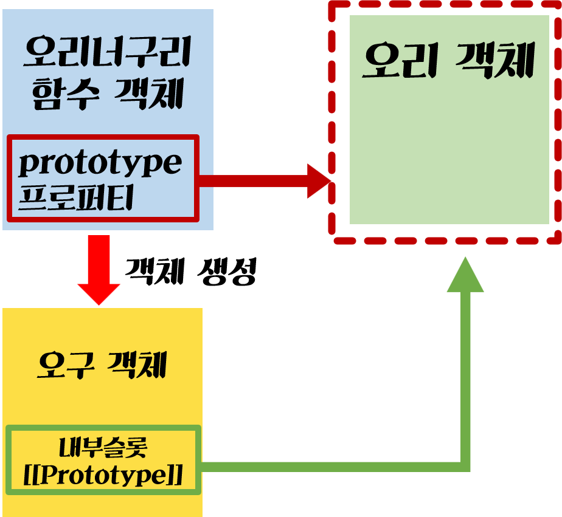

# 포로토타입

## 목차

[1. 객체 지향 프로그래밍](#1-객체-지향-프로그래밍)

[2. 자바스크립트에서의 객체 지향](#2-자바스크립트에서의-객체-지향)

[3. 프로토타입](#3-프로토타입)

[4. 생성자 함수와 프로토타입](#4-생성자-함수와-프로토타입)

[5. 결론](#5-결론)

## 1. 객체 지향 프로그래밍

객체 지향 프로그래밍은 초기의 절차 지향적 프로그래밍을 보완하기 위해서 만들어졌다.

절차 지향적 프로그래밍은 풀어야할 '문제'에 초점을 맞춰서 이 '문제'를 풀어나가는 '절차'에 초점을 맞췄다고 볼 수 있다.하지만 프로그래밍이 점점 발전하고, 프로그램의 규모가 점점 커지면서 이런 절차 지향적인 패러다임을 통해서는 한계가 있었다.

따라서, 세상을 **객체** 로 모델링하여 프로그래밍을 하려는 시도를 하기 시작하였다. 이것이 **객체 지향 프로그래밍** 이다.

**객체 지향 프로그래밍** 에서는 **객체** 와 **객체끼리의 상호작용** 을 통하여 세상을 모델링하여 표현한다. 즉 세상을 표현할 때, 객체 끼리의 상호작용을 표현하는 것이지 객체 내부에서 어떤 일이 발생하는지에 대해서는 관심이 없다.

간단하게 객체 지향을 그림으로 표현하면 다음과 같다.

  

### 객체의 정의 (by Class)

어쨌던 간에, 객체 지향 프로그래밍이라는 것은 객체끼리의 상호 소통으로 프로그램을 표현한다. 그렇다면 이러한 **객체** 는 어떻게 정의할 수 있었을까? 객체를 정의하는 방법은 크게 **Class 기반** 과 **Prototype** 기반으로 나누어서 생각할 수 있다.

  

먼저, class 기반으로 객체를 어떻게 모델링 하였는가에 대해서 생각해보자.
흔히 class 기반의 객체지향 언어들에서 **Class** 와 **객체** 의 관계를 설명할 때, **붕어빵 틀** 과 **붕어빵** 의 관계로 빗대어서 설명한다.
즉, Class는 실제로 존재하는 **객체** 가 아니라, 이 **객체** 를 만들기 위한 일종의 **틀** 이라고 생각할 수 있다.
이를 다르게 설명하면, 우선 **객체들을 클래스 라는 일종의 틀, 분류 기준으로 나누고, 이 기준을 통하여** 객체를 만들고, 만들어진 객체는 클래스 안의 속성과 메소드를 상속받는다. 그리고 이 객체들끼리 상호 메시지를 주고 받게 하는 식으로 동작하게 된다.

따라서 class 기반의 객체지향에서 객체의 생성과 동작은 다음으로 요약할 수 있다.

1. 객체는 미리 분류된 기준이라고 할 수 있는, **클래스** 를 통해서, 생성된다.
2. **클래스**로 만들어진 객체는, 클래스가 가지고 있는 속성과 메소드를 상속받는다.
3. 그리고 클래스 기반으로 만들어진 객체는 클래스라는 **틀** 로 만들어진 객체이기 때문에, 모든 인스턴스가 클래스에 정의된 같은 구조를 가지고, 보통 런타임에 바꿀 수 없다.
4. 마지막으로 객체끼리의 소통으로 프로그램이 동작하게 된다.

하지만, 알다시피 자바스크립트는 **프로토타입 기반** 으로 객체지향을 구현하였다. 즉, **자바스크립트에서의 객체는 prototype으로 모델링되었다고 할 수 있다.**

## 2. 자바스크립트에서의 객체 지향

> **"Objects in the real world have only one thing in common: they are all different"** (anonymous, A. Taivalsaari, JOOP, Nov. 1997)
>
> 실제 세계의 객체(Object)가 가지는 공통점은 오직 하나 밖에 없다 : 객체들은 모두 서로 다르다.

그렇다면 프로토타입 기반의 객체 지향에서는 객체를 어떻게 모델링하였을까?
클래스 기반의 객체와 비교해서 생각해보자. 클래스 기반의 객체에서는 객체가 **클래스** 를 통해서 만들어진다, 이를 풀어서 말하면 위에서 말했듯이 **일종의 틀, 분류 기준** 을 통해서 객체를 생성한다. 따라서, 클래스 기반의 객체 지향 프로그래밍 언어에서는 **클래스** 는 일종의 틀이고 분류 기준이지 객체가 아니다.

그렇다면 **프로토타입** 기반의 객체 지향은 어떻게 구현이 되는 것일까? 우선 **프로토타입**이라는 용어에 대해서 생각을 해보자. **프로토타입**의 사전적인 정의는 **원형** 이다. 프로토타입 기반으로 객체 지향 프로그래밍을 한다는 것은 **프로토타입이라는 원형의 객체**를 이용하여 객체 지향을 구현한다는 것과 같다.

따라서, 클래스와는 다르게 **프로토타입은 객체의 형태로 존재한다.** 프로토타입을 통한 상속은 개별 객체의 `[[Prototype]]` 이라는 내부 속성에 해당 프로토타입의 객체를 지정하는 형식으로 구현된다.

  


정리하면, 자바스크립트의 객체 지향 프로그래밍에서는 오직 **개별적인 객체**만 존재하고, 객체의 상속은 객체의 `[[Prototype]]` 속성에 상속받을 객체(프로토타입 객체)를 추가하는 식으로 이루어진다. 그리고 그 객체와 프로토타입 객체는 프로토타입 체인을 이루게 되고, 이 체인을 통하여 상위 객체의 속성이나 메소드를 사용할 수 있다. 따라서 프로토타입 객체를 상속받은 객체들 역시 각각 **프로토타입의 속성을 가지고 있다**라는 공통점만 있을 뿐, 개별적인 객체이다. 이 말은 각 객체들이 유사한 속성을 가질 뿐 객체들의 구조나 동작 방식은 다를 수 있다는 뜻이다.

## 3. 프로토타입

구체적으로 자바스크립트의 프로토타입을 통한 상속이 어떻게 동작되는지 살펴보자.
간단한 코드를 보자.

참고로, `__proto__`의 경우, 다소 구식의 방식이기 때문에 사용하지 않는 것이 좋지만, 설명을 위해서 `__proto__`를 사용하여 상속을 구현해보도록 하겠다.

```javascript
const 오리 = {
  부리: true,
  귀여움: true,
};

const 오리너구리 = {
  날수있음: false,
};

오리너구리.__proto__ = 오리;

console.log(오리너구리.부리, 오리너구리.귀여움, 오리너구리.날수있음); // true, true, false
console.log(오리.줄무늬); // undefined
```

코드를 보면 우선 `오리`라는 객체를 생성하고 `오리너구리`라는 객체를 생성한다.
그리고 겍체의 내부 슬롯인 `[[Prototype]]` 에 대한 getter이자 setter인 (이 코드에서는 setter로 사용됨) `__proto__` 를 통하여 `오리너구리`라는 객체의 프로토타입을 `오리`라고 지정한다.
이 말은 `오리너구리`와 `오리`라는 객체가 프로토타입 체인을 이룬다고 할 수 있다.
그리고 이 프로토타입 체인을 통하여 `오리너구리` 객체에서 `오리` 객체에 접근하여, 속성을 사용할 수 있다.
하지만, `오리` 객체에서의 프로토타입 체인에는 `오리너구리`객체가 없기 때문에 `오리너구리` 객체의 속성을 사용할 수 없다.
또한 `오리` 객체와 `오리너구리` 객체는 개별적인 객체라는 것을 알 수 있다.

그림으로 나타내면 다음과 같다.

  

프로토타입에 객체를 지정하는 방식으로, 상속을 구현하기 때문에 한번 만들어지면 구조나 동작방식이 고정되는 클래스 기반의 상속과는 다르게, 코드가 실행될 때 구조나 동작방식을 바꿀 수 있다.

## 4. 생성자 함수와 프로토타입

현재는 `__proto__`나 `Object.getPrototypeOf(obj)`, `Object.setPrototypeOf(obj, proto)`와 같은 메소드들을 이용해서 객체의 내부슬롯인 `[[Prototype]]` 에 접근할 수 있으나, 자바스크립트가 만들어질 당시에는 `[[Prototype]]`에 접근할 수 없었으므로, 함수 객체가 가지는 `prototype`이라는 프로퍼티를 이용할 수 밖에 없었다.
이 `prototype`은 함수 객체의 프로퍼티이기 때문에, 내부 슬롯인 `[[Prototype]]`와는 달리 `prototype`에 접근하여 프로토타입을 설정하고, 상속을 구현해낼 수 있다.

따라서, 생성자 함수를 통하여 객체를 만들고 프로토타입 기반의 상속을 구현해보자.

```javascript
const 오리 = {
  부리: true,
  귀여움: true,
};

function 오리너구리() {
  this.날수있음 = false;
}

오리너구리.prototype = 오리;

let 오구 = new 오리너구리();

console.log(오구.귀여움, 오구.부리); // true, true
```

위의 코드에서는 `오리너구리`라는 생성자 함수를 만들고,
이 함수의 프로퍼티인 `prototype` 를 `오리`로 지정한다.
이렇게하면 생성자 함수 `오리너구리`를 통하여 만들어진 객체의 `[[Prototype]]`을
`오리`로 설정하라는 것이다.

이를 그림으로 나타내면 다음과 같다.

  

## Object.prototype

위의 내용을 확장해서 생각해보자. 모든 함수는 `prototype` 이라는 프로퍼티를 가진다. 이 말은 모든 생성자 함수가 `prototype` 이라는 프로퍼티를 가진다고 할 수 있다. 또한, 객체들은 자바스크립트에서 제공되는 생성자 함수를 통하여 만들어진다.

자바스크립트의 거의 모든 것은 `Object`라고 할 수 있다. 자바스크립트의 내장 객체를 생성할 때, 내부적으로 생성자 함수를 통해서 객체가 생성되고, Object에서 사용할 수 있는 메소드와 프로퍼티를 사용할 수 있다. 이 말을 위의 내용과 연결시켜보면, 생성자 함수의 `prototype` 프로퍼티가 `Object에서 사용할 수 있는 메소드와 프로퍼티가 정의된 객체`를 참조한다고 할 수 있고, `Object에서 사용할 수 있는 메소드와 프로퍼티가 정의된 객체`는 `Object.prototype`이라고 한다.

이는 `Array`나 `Function`과 같은 다른 내장 객체 역시 마찬가지다. `Array`와 `Function` 역시 객체이므로, 이를 생성할 때 내부적으로 `Array 생성자 함수`와 `Function 생성자 함수`가 호출될 것이고, 이 함수에 `prototype`이라는 프로퍼티가 존재할 것이다. 그리고 이 `prototype` 프로퍼티는 `Array`와 `Function`의 프로퍼티나 메소드를 정의한 프로토타입 객체인 `Array.prototype`과 `Function.prototype`이 참조할 것이다.

이렇게 각 내장 객체(`Array.prototype`과 `Function.prototype`)의 프로토타입 역시 Object 형태로 존재한다. 따라서 이 객체의 프로토타입이 결국 `Object.prototype`이 되는 것이고, 자바스크립트에서 가장 상위 객체가 `Object.prototype`이라고 할 수 있다.


## 5. 결론

따라서, 자바스크립트는 객체를 **프로토타입**으로 모델링하고, **프로토타입**으로 모델링된 객체들은 저마다 unique한 객체들이며, **프로토타입**을 통한 상속은 객체의 내부슬롯 `[[Prototype]]`에 상속받을 객체를 지정하는 방식으로 이루어지며, 생성자 함수의 `prototype` 프로퍼티에 객체를 지정하면, 이 생성자 함수를 통해 만들어지는 객체들의 내부 슬롯 `[[Prototype]]`을 그 객체로 지정하겠다는 의미와 같다.

## 참고자료

https://tecoble.techcourse.co.kr/post/2021-06-14-prototype/

https://medium.com/@limsungmook/%EC%9E%90%EB%B0%94%EC%8A%A4%ED%81%AC%EB%A6%BD%ED%8A%B8%EB%8A%94-%EC%99%9C-%ED%94%84%EB%A1%9C%ED%86%A0%ED%83%80%EC%9E%85%EC%9D%84-%EC%84%A0%ED%83%9D%ED%96%88%EC%9D%84%EA%B9%8C-997f985adb42

https://medium.com/@bluesh55/javascript-prototype-%EC%9D%B4%ED%95%B4%ED%95%98%EA%B8%B0-f8e67c286b67

https://expertiza.csc.ncsu.edu/index.php/CSC/ECE_517_Fall_2010/ch4_4e_ms

https://developer.mozilla.org/ko/docs/web/javascript/inheritance_and_the_prototype_chain

https://medium.com/hcleedev/dev-%EA%B0%9D%EC%B2%B4%EC%A7%80%ED%96%A5%EC%9D%80-%ED%81%B4%EB%9E%98%EC%8A%A4%EA%B0%80-%EC%95%84%EB%8B%8C-%EC%97%AD%ED%95%A0%EA%B3%BC-%ED%98%91%EB%A0%A5%EC%9D%B4%EB%8B%A4-8889a5e02452

https://medium.com/background-thread/why-javascript-is-an-oop-language-even-though-it-doesnt-have-classes-92a4e202176f

https://ko.javascript.info/function-prototype

https://ko.javascript.info/native-prototypes
