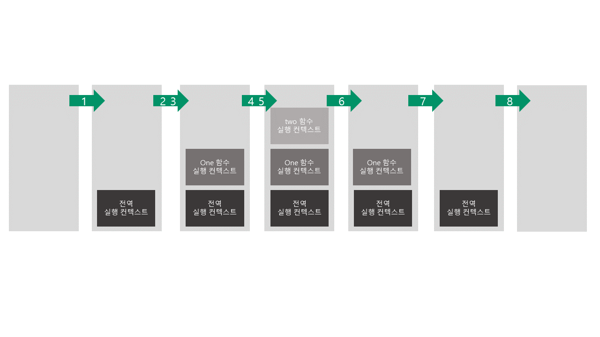
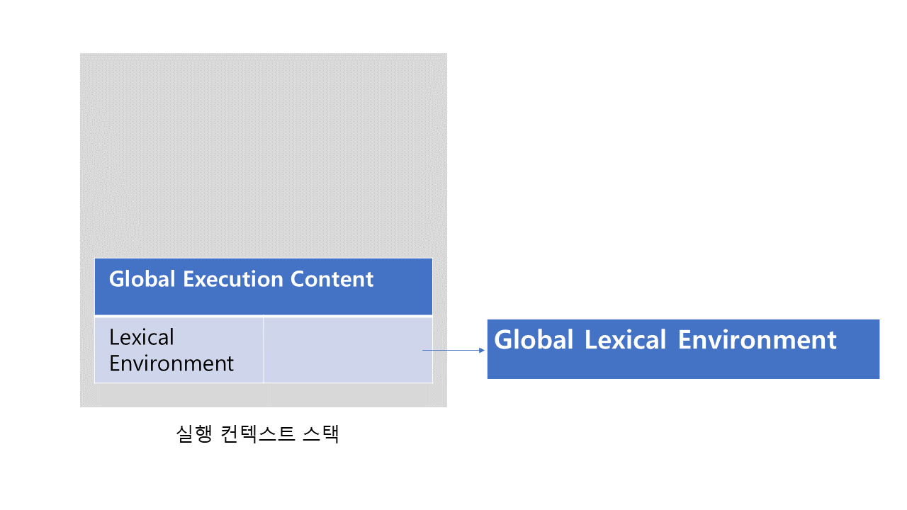
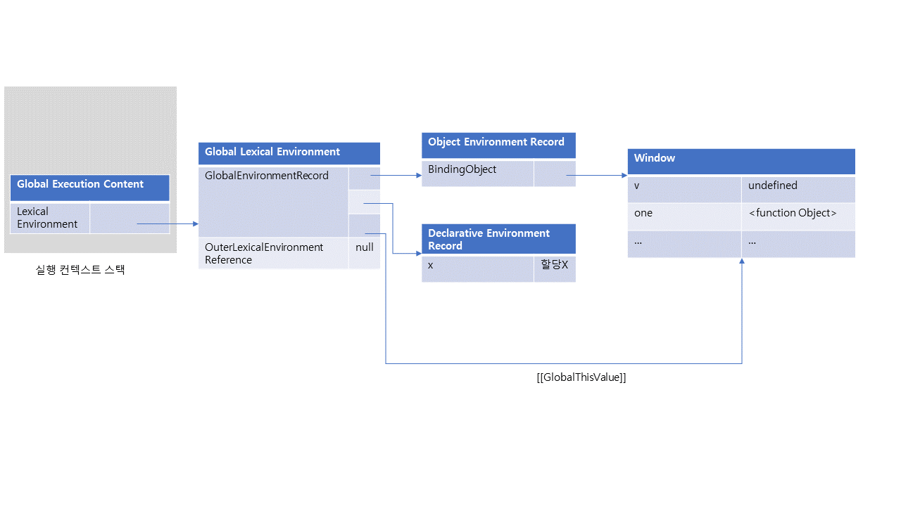
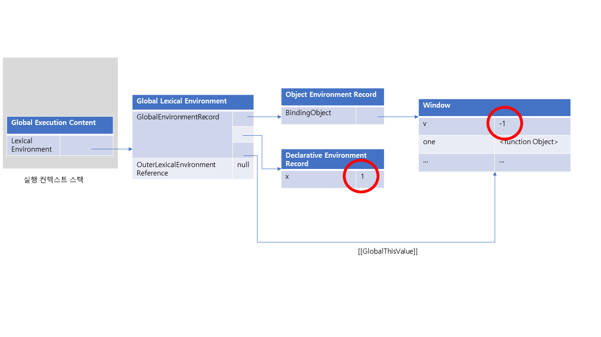
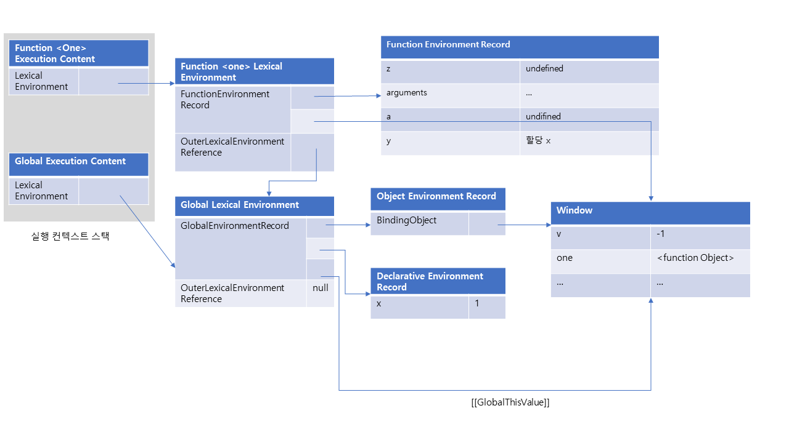

# JS엔진이 소스코드를 처리하는 법
자바스크립트 엔진은 아래의 2개의 과정으로 나누어 처리한다. 

 - 소스코드의 평가
 - 소스코드의 실행 

## 소스코드의 평가
소스코드 평가 과정에는 실행 컨텍스트를 생성하고 변수, 함수 등의 선언문만 먼저 실행해서 생성된 변수나 함수 식별자를 키로 실행 컨텍스트가 관리하는 스코프에 등록한다.

## 소스코드의 실행
소스코드 평가 과정이 끝나면 비로소 선언문을 제외한 소스코드가 순차적으로 실행되기 시작하고 소스코드가 순차적으로 실행된다.

이때 소스코드 실행에 필요한 정보, 즉 변수나 함수의 참조를 실행 컨텍스트가 관리하는 스코프에서 검색해서 취득한다. 

그리고 변수 값의 변경 등 소스코드의 실행 결과는 다시 실행컨텍스트가 관리하는 스코프에 등록된다.

# 그렇다면 실행 컨텍스트는?
실행컨텍스트는 소스코드를 실행하는 데 필요한 환경을 모아놓고 관리하는 객체이다. 

# 실행 컨텍스트의 역할
아래의 글은 우리가 일반적으로 사용하는 전역, 함수 코드에서 JS엔진이 코드를 평가, 실행할 때 처리하는 일들을 적은 것이다.
이 것을 읽고 실행 컨텍스트의 역할에 대해 알아보자!😊

## 1. 전역 코드 평가
소스 코드 평가 과정에서는 선언문만 먼저 실행된다.

따라서 전역 코드의 변수 선언문과 함수 선언문이 먼저 실행하고  생성된 전역 변수와 전역 함수가 실행 컨텍스트가 관리하는 전역 스코프에 등록된다.

이때 var 키워드로 선언된 전역 변수와 함수 선언문으로 정의된 전역 함수는 전역 객체의 프로퍼티와 메서드가 된다.

## 2. 전역 코드 실행
전역 코드 평가 과정이 끝나면 런타임이 시작되면서 전역 코드가 순차적으로 실행된다. 

이때 전역 변수에 값이 할당되고 함수가 호출된다.

함수가 호출되면 순차적으로 실행되던 전역 코드의 실행을 일시 중단하고 코드 실행 순서를 변경해 함수 내부로 진입한다.

## 3. 함수 코드 평가
함수 호출 시 함수 내부로 진입한다. 
함수 내부의 문들을 실행하기에 앞서 함수 코드 평가 과정을 거치며 함수 코드를 실행하기 위한 준비를 한다. 

이때 매개변수와 지역 변수 선언문이 먼저 실행되고, 그 결과 생성된 매개변수와 지역변수가 실행컨텍스트가 관리하는 지역 스코프에 등록된다. 

또한 함수 내부에서 지역변수처럼 사용할 수 있는 arguments 객체가 생성되어 지역 스코프에 등록되고 this바인딩도 결정된다.

## 4. 함수 코드 실행
함수 코드 평가 과정이 끝나면 런타임이 시작되어 함수 코드가 순차적으로 실행되기 시작한다.
매개변수와 지역변수에 값이 할당된다.
함수 안에 있는 코드들이 차례로 실행되고 끝나면 함수 호출 이전으로 되돌아가 전역 코드 실행을 계속한다.

## 이와 같이 코드가 실행되려면 다음과 같이 스코프, 식별자, 코드 실행 순서 등의 관리가 필요하다.

>- 선언에 의해 생성된 모든 식별자를 스코프를 구분해 등록하고 상태변화를 지속적으로 관리할 수 있어야 한다.
>- 스코프는 중첩 관계에 의해 스코프 체인을 형성해야 한다. 
스코프 체인을 통해 상위 스코프로 이동하며 식별자를 검색할 수 있어야 한다.
>- 현재 실행 중인 코드의 실행 순서를 변경할 수 있어야 하며 함수 호출에 의한 실행 순서를 변경할 수 있어야 하며 다시 되돌아갈 수도 있어야 한다. 

### 이 모든 것을 실행 컨텍스트가 관리한다!
그렇다면 실행 컨텍스트는 이런 많은 일들을 어떻게 관리하는 것일까?

## 실행 컨텍스트 스택(Call stack)
실행 컨텍스트 내부를 살펴보기에 앞서 먼저 JS엔진이 어떻게 실행 컨텍스트의 순서를 관리하는지
아래의 예시 코드와 그림을 보면서 call stack을 이해해 보자.

예시코드)
```js
const x = 1; // 전역 스코프
function one(){ // 함수 스코프
    const y = 2;
    function two(){ // 함수 스코프
        const z = 3;
        console.log(x + y + z);
    }
    two();
}
one();
console.log(x);
```

콜스택의 변동 과정이다.

위에서 말했듯이, 코드는 평가와 실행으로 이루어진다. 
#### 1. 전역 코드 평가
전역 실행 컨텍스트를 생성하고 실행 컨텍스트 스택에 push한다. 이때 전역 변수 x 와 one은 전역 실행 컨텍스트에 등록된다.
#### 2. 전역 코드 실행
전역 코드가 실행되면서 전역 변수 x에 1이라는 값이 할당되고 전역 함수 one이 호출된다. 
#### 3. one 함수 코드 평가
one이 호출되면서 전역 코드의 실행은 일시 중단되고, 실행 컨텍스트 스택에 one 함수의 실행 컨텍스트가 쌓인다. 그러면서 코드의 제어권이 one 함수 내부로 이동한다.
one함수 내부의 코드가 평가되면서 y와 two가 one 함수의 실행 컨텍스트에 등록된다.
#### 4. one 함수 코드 실행
one 함수의 코드가 실행되면서 y에는 2가 할당되고 다음으로 two 함수가 호출된다.
#### 5. two 함수 코드 평가
two 함수가 호출되면서 one 함수 코드의 실행은 일시 중단되고, 실행 컨텍스트 스택에 two 함수의 실행 컨텍스트가 쌓인다.
 그러면서 코드의 제어권이 two 함수 내부로 이동한다.
two 함수의 코드가 평가되면서 z가 two 함수의 실행 컨텍스트에 등록된다. 
#### 6. two 함수 코드 실행
실행되면서 console함수가 실행된다. console 함수를 찾기 위해 스코프 체인을 타고 올라가면서 찾는다.
console.log 메서드가 종료되면 함수 코드 실행 과정이 종료된다. 
#### 7. one 함수로 복귀
two 함수가 끝나고, 스택에서 pop 하여 two 함수 실행 컨텍스트를 제거한다.
one 함수가 마저 실행되고, two 함수를 호출한 뒤 함수가 끝나면 one 함수 코드 실행과정이 종료된다. 
#### 8. 전역 코드로 복귀
one 함수가 끝나고, js엔진이 실행 컨텍스트 스택에서 one 함수를 pop해서 제거한다.
전역 함수도 실행을 마치고 실행 컨텍스트 스택에서 pop 되어 실행 컨텍스트가 빈 상태로 끝난다.

이처럼 JS엔진은 콜스택으로 코드의 실행 순서를 관리한다. 
소스코드가 평가되면 실행 컨텍스트가 생성되고 실행 컨텍스트 스택의 최상위에 쌓인다. 
실행 컨텍스트 스택의 최상위에 존재하는 실행 컨텍스트는 언제나 **실행 중인 코드의 실행 컨텍스트**이다. 

<br>
 
## 렉시컬 환경
그렇다면 본격적으로 실행 컨텍스트의 핵심인 렉시컬 환경으로 넘어가 보자. 
렉시컬 환경은 **식별자와 식별자에 바인딩 된 값, 그리고 상위 스코프에 대한 참조를 기록**하는 자료구조로 실행 컨텍스트를 구성하는 컴포넌트이다. 
실행 컨텍스트 스택이 **코드의 실행 순서를 관리**한다면 **렉시컬 환경은 스코프와 식별자를 관리**한다.

렉시컬 환경은 키와 값을 갖는 객체 형태의 스코프를 생성하여 식별자를 키로 등록하고 식별자에 바인딩된 값을 관리한다. 

실행 컨텍스트는 LexcicalEnvironment 컴포넌트와 VariableEnvironment 컴포넌트로 구성되는데,이때 이 두 컴포넌트들은 동일한 렉시컬 환경을 참조한다
이후 상황 변화에 따라 variable element 컴포넌트를 위한 새로운 렉시컬 환경을 생성하고, 내용이 달라지게 된다. (분량 문제로 이 부분은 자세히 하지 않고 넘어간다🥲)

### 렉시컬 환경의 구성
렉시컬 환경은 각각 1) 환경레코드 2) 외부 렉시컬 환경에 대한 참조 3)this 바인딩으로 이루어진다.

환경레코드는 스코프에 포함된 식별자를 등록하고 등록된 식별자에 바인딩된 값을 관리하는 저장소이다.
이때 환경 레코드는 소스코드의 타입에 따라 관리하는 내용에 차이가 있다. 

외부 렉시컬 환경에 대한 참조는 해당 실행 컨텍스트를 생성한 소스코드를 포함하는 상위 코드의 렉시컬 환경을 말한다.
외부 렉시컬 환경에 대한 참조를 통해 단방향 링크드리스트인 스코프 체인을 구현한다.
this 바인딩에서는 this를 가리키는 역할을 한다.

 

### 실행 컨텍스트 동작
아래의 예시코드를 보면서 렉시컬 환경이 어떻게 이루어져 있는지, 어떻게 동작하는지 이해해 보자.

예시코드)
```js
var v = -1;
const x = 1; // 전역 스코프
function one(z){ // 함수 스코프
    var a = -2;
    const y = 2;
        console.log(x + y + z);
}
one(1);
```

### 1. 전역 객체를 생성
전역 객체는 코드 평가 이전에 생성된다. 

이때 전역 객체에는 빌트인 전역 프로퍼티와 빌트인 전역 함수, 그리고 표준 빌트인 객체가 추가되며 동작 환경(클라이언트 사이드 또는 서버 사이드) 에 따라 클라이언트 사이드 web api 또는 특정 환경을 위한 호스트 객체를 포함한다.

### 2. 전역 코드 평가 
전역 코드 평가는 다음의 방식으로 이루어진다.

1. 전역 실행 컨텍스트 생성
2. 전역 렉시컬 환경 생성
    1) 전역 환경 레코드 생성
        a) 객체 환경 레코드 생성
        b) 선언적 환경 레코드 생성
    2) this 바인딩
    3) 외부 랙시컬 환경에 대한 참조 결정

<br>
차례로 살펴보자.

 

1. 전역 실행 컨텍스트를 생성하고 실행 컨텍스트 스택에 push한다.

 

2. 전역 렉시컬 환경을 생성하고 전역 실행 컨텍스트에 바인딩한다.

렉시컬 환경은 앞서 말했듯이 환경레코드 / 외부 렉시컬 환경에 대한 참조 로 이루어진다. 

1) 전역 환경 레코드는 객체 환경 레코드와 선언적 환경 레코드로 구성되어 있는데,  var, let/const에 따라 나눠 들어가게 된다. 
**이것이 바로 const, let, var의 차이를 나타낸다!**

 
 
 ```js
var v = -1; // 객체 환경 레코드로
const x = 1;  // 선언적 환경 레코드로
function one(){ //...
```

a) 객체 환경 레코드는 기존의 전역 객체가 관리하던 var 키워드, 전역 변수, 전역 함수 등을 관리한다. 
이때 전역 객체 BindingObject와 연결하기 때문에 이곳에 등록된 함수, 변수는 전역 객체의 프로퍼티와 메소드가 된다. 
 => 이것 때문에 전역 객체를 가리키는 식별자(window)없이 전역 객체의 프로퍼티를 참조할 수 있다.
 
 var 키워드는 선언 단계와 초기화 단계가 동시에 진행되기 때문에, 
전역 코드 평가 시점에 객체 환경 레코드에 바인딩된 BindingObject를 통해 전역 객체에 식별자를 키로, undefined를 바인딩한다. 
또한 함수 선언문으로 정의한 함수 one도 평가될 때 전역 객체에 키로 등록하고 바로 생성된 함수 객체를 즉시 할당하기 때문에 선언문 이전에 호출할 수 있다.
 
b) 선언적 환경 레코드는 let, const 키워드로 선언한 전역 변수를 관리한다.

const(또는 let)는 평가될 때 호이스팅 되지만 전역 객체의 프로퍼티로 등록되지 않고 선언적 환경 레코드로 들어간다. 
또 선언 단계와 초기화 단계가 분리되어 진행되기 때문에 TDZ(temporal dead zone)에 빠지게 된다.

3. 전역 코드에서 this바인딩은 전역 객체를 가리킨다. 
4. 전역 코드는 외부 객체가 없기 때문에 외부 렉시컬에 대한 참조가 없다. 


### 3. 전역 코드 실행

 

전역 코드가 실행되고, 순차적으로 변수 할당문이 실행되어 전역 변수 v, x에 값이 할당된다. 

### 2. 함수 코드 평가 
함수 코드 평가는 다음과 같이 이루어진다.
1. 함수 실행 컨텍스트 생성
    1) 함수 렉시컬 환경 생성
    2) this 바인딩
    3) 외부 렉시컬 환경에 대한 참조 결정


1. one 함수 실행 컨텍스트 생성
 
실행컨텍스트가 생성된다. 이것은 함수 렉시컬 환경 완성 후 실행 컨텍스트에 push 된다. 

1) 함수 렉시컬 환경 생성

 
렉시컬 환경은 a) 함수 환경 레코드, b) 외부 렉시컬 환경 참조 로 이루어진다.

함수 환경 레코드에서는 매개변수, arguments 객체, 함수 내부에서 선언한 지역 변수와 중첩함수를 등록하고 관리한다. 

2) this 바인딩은 일반함수로써 호출되었기 때문에 전역 객체를 가리킨다.(만약 객체 참조로부터 호출되면, this의 값은 해당 객체나 undefined 등으로 설정된다)

3) 외부 렉시컬 환경은 one 함수가 전역 객체에서 정의되었기 때문에 전역 코드 평가 시점에서 평가되었다. 따라서 전역 렉시컬 환경의 참조가 할당된다. 


### 3. 함수 코드 실행
 
순차적으로 one에 있는 코드가 실행된다. 매개변수에 인수가 할당되고, 변수 할당문이 실행되어 값이 할당된다. 
또한 console함수가 실행된다. console 함수를 찾기 위해 스코프 체인을 타고 올라가는데, console 함수는 스코프가 아닌 전역 객체에 프로퍼티로 존재한다.

하지만 전역 객체의 프로퍼티는 전역 변수 처럼 전역 스코프를 통해 검색이 가능하기 때문에, console 객체를 찾고, console 객체의 프로토타입 체인을 통해 log 프로퍼티를 검색한다. 

console.log 메서드를 찾고 인수로 전달된 표현식을 스코프체인으로 검색하면서 평가한다.

x는 전역 렉시컬 환경에서, y, z는 함수 렉시컬 환경에서 찾는다. 

### 4. 함수 코드 실행 종료
console.log가 실행되고 종료하면 one 함수 코드의 실행이 종료되고 스택에서 pop된다.

### 5. 전역 코드 실행 종료
이제 전역 코드에서도 할 일이 끝나서 스택에서 pop되고, 스택은 비워진다.

### 간단 정리 및 확인 문제

#### 간단 정리
- 실행컨텍스트는 소스코드를 실행하는 데 필요한 환경을 모아놓고 코드의 실행 결과를 실제로 관리하는 객체이다. 

- JS엔진은 코드 실행 순서는 실행 컨텍스트 스택으로 관리하고, 실행 컨텍스트의 식별자와 스코프는 실행 컨텍스트의 렉시컬 환경으로 관리한다. 

- 실행 컨텍스트의 렉시컬 환경은 1) 환경레코드 2) 외부 렉시컬 환경에 대한 참조 3)this 바인딩으로 이루어진다.

#### 확인 문제

전역 객체를 가리키는 식별자(window)없이 전역 객체의 프로퍼티를 참조할 수 있다.
(O, X)
실행 컨텍스트 스택의 최상위에 존재하는 실행 컨텍스트는 언제나 실행 중인 코드의 실행 컨텍스트이다.
(O, X)
const(또는 let)는 평가될 때 호이스팅 되지 않으면서 전역 객체의 프로퍼티로 등록되지 않고 선언적 환경 레코드로 들어간다.
(O, X)

### 참고한 자료
- 모던 자바스크립트 DEEP DIVE
- 코어 자바스크립트
- https://poiemaweb.com/js-execution-context


