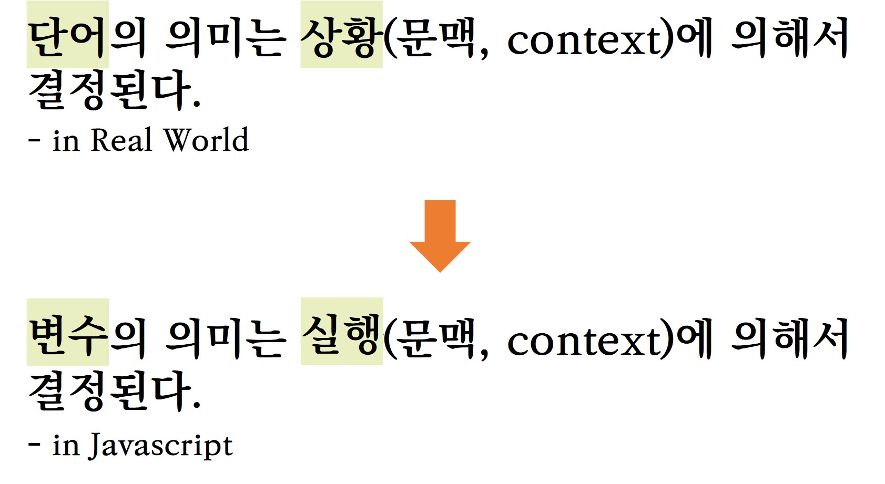
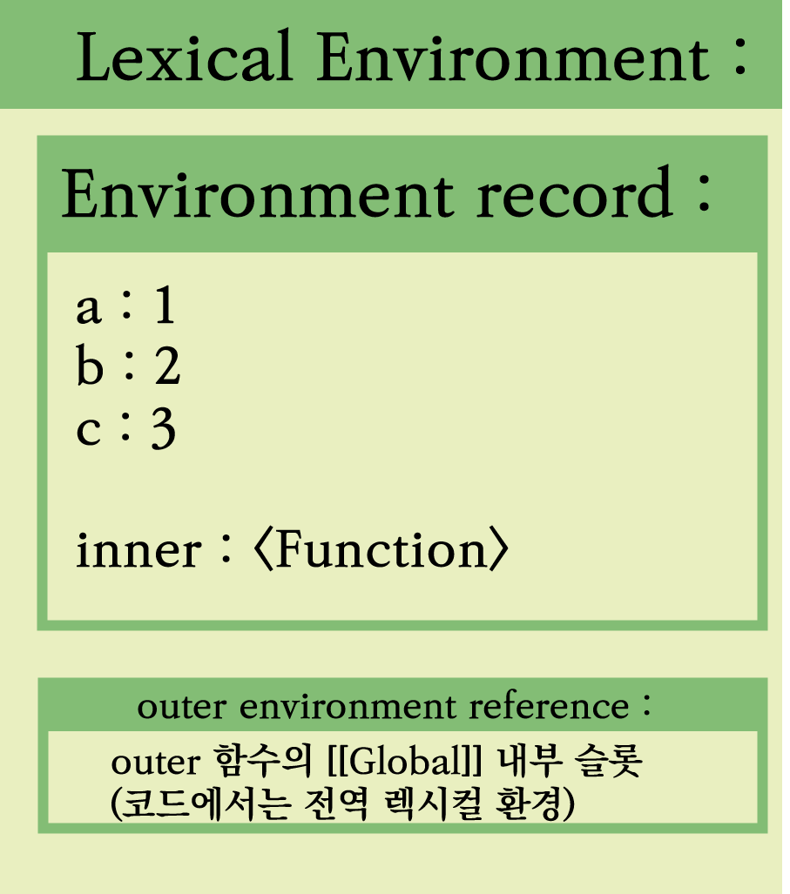

# 목차

- [목차](#목차)
- [들어가면서](#들어가면서)
- [실행 컨텍스트](#실행-컨텍스트)
- [렉시컬 환경](#렉시컬-환경)
  - [Environment record(환경 레코드)](#environment-record환경-레코드)
  - [Outer environment reference(상위 환경에 대한 참조)](#outer-environment-reference상위-환경에-대한-참조)
- [마무리](#마무리)
- [주석](#주석)
- [참고자료](#참고자료)

# 들어가면서

> 변수의 의미는 그 어휘적인 (Lexical), 실행 문맥(Execution Context) 에서의 의미가 된다.
>
> ㅡ [자바스크립트는 왜 프로토타입을 선택했을까?](https://medium.com/@limsungmook/%EC%9E%90%EB%B0%94%EC%8A%A4%ED%81%AC%EB%A6%BD%ED%8A%B8%EB%8A%94-%EC%99%9C-%ED%94%84%EB%A1%9C%ED%86%A0%ED%83%80%EC%9E%85%EC%9D%84-%EC%84%A0%ED%83%9D%ED%96%88%EC%9D%84%EA%B9%8C-997f985adb42)

자바스크립트는 **프로토타입 기반**의 `언어`라고 설명합니다. 이 `프로토타입` 이라는 용어는 비트겐슈타인의 의미사용이론과 가족유사성을 정리한 Rosch의 `프로토타입 이론`에서 설명하는 개념입니다.

이 프로토타입 이론의 `의미사용이론`에서 우리가 통상적으로 언어를 구사한다고 할 때(말을 하거나, 글을 쓰거나) `사용하는 '단어'의 의미는 문맥에 의해서 생성된다.`고 말합니다. 이 말을 간단하게 설명하면 **우리가 사용하는 언어, 단어의 의미는 사용하는 환경에 따라 결정된다.** 라고 설명할 수 있습니다.

자바스크립트는 `프로토타입 이론을 바탕으로 모델링한 언어`이므로, 이 내용을 자바스크립트에도 대응시킬 수 있습니다.


이 `단어`를 변수라고 생각해보고, `상황`을 `코드 실행`이라고 생각해봅시다. 그렇다면 현실 세상에서 그랬던 것 처럼 자바스크립트에서 `변수`란 `코드가 실행되는 문맥(context)`에 의하여 의미가 결정된다고 할 수 있습니다.

그렇다면, 이 자바스크립트는 `코드가 실행되는 문맥`을 어떻게 설명할 수 있을까요? 이를 위하여, 자바스크립트는 `실행컨텍스트`를 구현하였고, 이 실행컨텍스트를 구현할 때, `렉시컬 환경`이라는 **자료구조**를 사용합니다.

# 실행 컨텍스트

모든 자바스크립트 코드를 실행할 때는 실행 컨텍스트가 필요하고, 이 실행컨텍스트는 `실행 코드`에 따라서 하나씩 논리적으로 스택의 형태로 쌓이게(`push`) 됩니다. 그리고 실행이 종료될 때마다 위에 있는 것부터 하나씩 사라집니다.(`pop`)

자바스크립트는 세 가지를 코드의 실행 기준으로 나누고, 이 기준에 따라서 실행 컨텍스트가 만들어 집니다.

1. Global (전역, 코드가 실행되자 마자)
2. Function
3. Eval
4. Module

자바스크립트에서 코드가 실행되면, 자바스크립트 엔진이 이 세 가지 기준에 따라 코드를 구분하고, 이 기준에 따라 실행 컨텍스트를 초기화하게 됩니다.

그리고 그 안에서 선언된 변수는 이 문맥에 따른 의미를 가지게 되는 것입니다. 따라서, 이 문맥(실행 컨텍스트)는 **현재 변수가 어떤 상황에 처해있는지에 대한 설명을 담고 있게 되고**, 이 설명을 위하여 `렉시컬 환경`이라는 일종의 자료구조를 사용하게 되었습니다.

따라서 실행 컨텍스트를 의사 코드로 나타내면 다음과 같습니다.

```javascript
ExecutionContetext = {
  LexicalEnvironment: [Lexical Environment],
  VariableEnvironment: [Lexical Environment],
};
```

이 글에서는 LexicalEnvironment 만 다루도록 하겠습니다.

# 렉시컬 환경

```javascript
Lexical Environment = {
    environment record: ~,
    outer environment reference : ~
}
```

렉시컬 환경은 `environment record(환경 레코드)`와 `outer environment reference(상위 환경에 대한 참조)`라는 프로퍼티를 가지고 있습니다.

```javascript
function outer() {
  const a = 1;
  const b = 2;
  const c = 3;

  function inner() {}
}

outer();
```

위의 코드를 전역에서 실행한다고 가정할 때, outer 함수의 렉시컬 환경은 다음과 같은 형태로 구성된다고 할 수 있습니다.

<center></center>

`environment record(환경 레코드)`의 경우, 식별자의 정의와 어떤 값을 담고 있는지의 정보를 담고 있고, `outer environment reference(상위 환경에 대한 참조)`의 경우 외부 렉시컬 환경에 대한 참조로 함수가 중첩되어있을 때, 상위 스코프 탐색을 위해서 사용합니다.

이러한 렉시컬 환경을 통해서, 자바스크립트의 많은 동작을 설명할 수 있습니다. 대표적으로 계속 언급하고 있는 `실행 컨텍스트`와 `스코프 체인에서의 식별자 처리 과정`, `클로저` 등이 있는데, 렉시컬 환경의 구성요소를 설명하면서 이 세 가지 동작에 대해서 간단하게 설명하도록 하겠습니다.

## Environment record(환경 레코드)

환경 레코드에 대한 내용을 먼저 살펴보도록 하겠습니다.

<center></center>

환경 레코드는 위와 같은 상속 구조를 가지고, 위의 함수 코드에서는 이 중 `Function Environment Record`으로 구성되어 있습니다.

```javascript
  environmentRecord: {
    // 함수 내에 선언된 변수와 함수의 정보
      a : 1,
      b : 2,
      c : 3,

      inner : <Function>

    // 내부 슬롯
    [[ThisValue]]: global, // Any
    [[ThisBindingStatus]]: 'uninitialized', // 'lexical' | 'initialized' |  'uninitialized'
    [[FunctionObject]]: outer, // Object
    [[HomeObject]]: undefined, // Object | undefined,
    [[NewTarget]]: undefined // Object | undefined

  }
```

내부 슬롯에 대한 자세한 설명들은 생략하고,`[[ThisValue]]`, `[[HomeObject]]`, `[[NewTarget]]` 등의 속성을 보면, `this` 바인딩이나 `super`, `new target` 등의 정보가 환경 레코드에서 관리됨을 알 수 있습니다.
결국, `this`와 같은 값들 역시 **실행되는 문맥**에서 관리되는 것입니다.

정리하자면 이 `렉시컬 환경`의 `환경 레코드`를 통하여, 현재 `실행 컨텍스트` 내에 선언된 식별자 정보를 알아낼 수 있습니다.

## Outer environment reference(상위 환경에 대한 참조)

앞선 환경 레코드가 현재 실행되고 있는 문맥에 대한 정보라고 하면, Outer environment reference 는 이전의 상황에 대한 정보라고 생각할 수 있습니다.

즉, 렉시컬 환경이 만들어지면서 이전의 상황에 대한 참조를 계속 저장하게 되고, 이 참조를 통하여, 중첩적으로 참조를 타고 올라가는 식으로 `외부에 있는 다른 스코프의 변수를 찾아가거나` 하는 과정이 발생하는 겁니다.<sup>[1](#footnote_1)</sup>

# 마무리

결론적으로 자바스크립트는 `렉시컬 환경`을 통하여 `현재 문맥을 설명하기 위한 상황`을 설명한다고 할 수 있습니다. 즉, 현실 세상에서 어떤 상황을 설명하는 과정과 자바스크립트의 문맥을 설명하는 과정으로 모델링 되었다고 생각할 수 있습니다.

# 주석

<a name="footnote_1">1</a> : 이렇게 식별자의 스코프를 타고 올라가는 걸 `스코프체인` 이라고 하지만, ES5부터 렉시컬 환경이 도입되면서 스코프 체인의 구현이 연결 리스트에서 참조를 타고 올라가는 식으로 바귀면서 스코프 체인이라는 용어보다는 `Lexical nesting structure` 또는 `Logical nesting of Lexical Environment values` 으로 표현하고 있습니다.

# 참고자료

[자바스크립트는 왜 프로토타입을 선택했을까?](https://medium.com/@limsungmook/%EC%9E%90%EB%B0%94%EC%8A%A4%ED%81%AC%EB%A6%BD%ED%8A%B8%EB%8A%94-%EC%99%9C-%ED%94%84%EB%A1%9C%ED%86%A0%ED%83%80%EC%9E%85%EC%9D%84-%EC%84%A0%ED%83%9D%ED%96%88%EC%9D%84%EA%B9%8C-997f985adb42)

[비트겐슈타인(8)-후기 사상 : 용도의미론(the use theory of meaning)](https://imnt.tistory.com/m/207)

[Lexical Environment](https://www.youtube.com/watch?v=OPc73p2d0T8)

[ECMAScript2015 Specification - Lexical Environments](https://262.ecma-international.org/6.0/#sec-lexical-environments)

[why var declaration fast than let (옛날 얘기임, 현재는 최적화가 되어서 이 내용이 적용되지 않음)](https://stackoverflow.com/questions/36847394/why-var-declaration-fast-than-let?noredirect=1&lq=1)

[자바스크립트 함수 (3) - Lexical Environment](https://ui.toast.com/weekly-pick/ko_20171006)

[ES6 문법 정리](https://jsdev.kr/t/es6/2944)

[Environment Record](https://velog.io/@shroad1802/environment-record)
