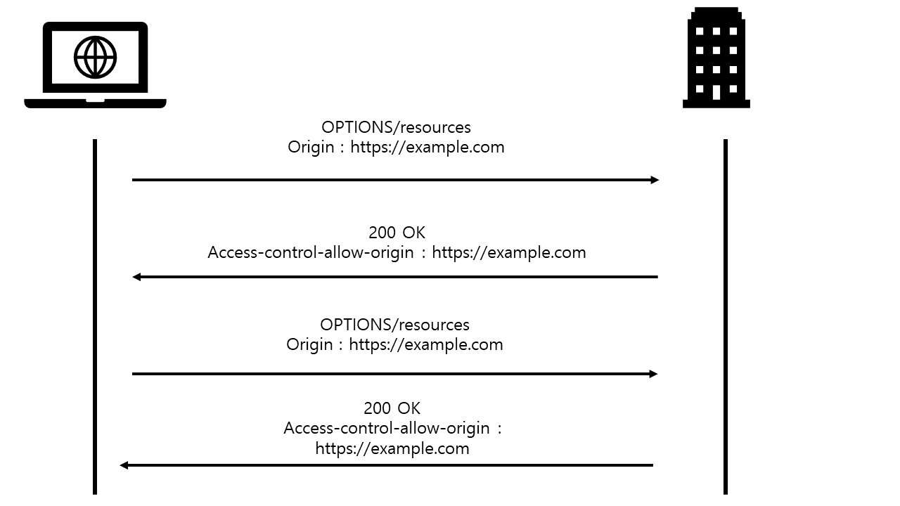

# CORS

# CORS의 배경

원칙적으로 웹브라우저에서는 다른 도메인으로 요청을 주고 받을 수 없었다. 

정적 웹 시절에는 다른 도메인으로 요청을 하게 되는 것은 일반적인 것이 아니었고, 보안 상 우려로 금지했다. 브라우저는 다른 도메인이면 요청 자체를 막는 선택을 했다. 

따라서 브라우저에서는 기본적으로 **동일 출처,** **Same-Origin** 정책을 따른다. 

이 정책을 **Same-Origin-Policy**라고 한다.

## 동일 출처(same origin)란?

[동일 출처 정책 - 웹 보안 | MDN](https://developer.mozilla.org/ko/docs/Web/Security/Same-origin_policy)

동일 출처는 **Protocol, Host(도메인), Port이 모두 같아야 한다.**


참고> ie에서는 port 검사를 하지 않아 보안상 더 취약하다. 

## 왜 동일 출처를 사용하는 것인가요?

xss 같은 공격을 방어하기 위함이다. 웹사이트에 악성 스크립트를 주입하고 악성 스크립트가 포함된 게시글을 열람한 피해자들의 쿠키는 해커에게 전송된다. 

이를 통해 해커는 피해자의 브라우저에서 스크립트를 실행해 세션을 가로체거나 웹사이트를 변조, 피싱 공격을 하는 등의 일이 일어날 수 있다.

### XSS 공격 예시


먼저 [https://devil.com](https://devil.com에서) 에서 user에게 홈페이지 접속을 하게 한다.(낚시성 글 등)유저가 홈페이지를 접속하면 유저의 브라우저에서 devil 사이트의 script 가 실행되는데, 이 script 파일에서는 gmail에 로그인해 정보 등을 불러오는 로직이 있다. 이때 사용자는 구글에서 사용하는 유저 쿠키, 세션 등을 가지고 있는데, 이를 통해 gmail에 로그인하고, 정보를 가져오게 된다. 이때 동일 출처 검사가 없다면 response를 받아 그대로 공격자가 정보를 받을 수 있게 된다. 

반면 sop 정책을 적용하면 현재 있는 [https://devel.com](https://devel.com) 과 [https://mail.google.com](https://main.google.com) 의 주소가 다르기 때문에 정보를 가져갈 수 없게 막는다. 

이러한 이유 때문에 SOP 정책을 원칙으로 한다. 

## 하지만,

 웹이 복잡해지면서 단순 문서 제공이 아닌 여러가지 기능이 필요하게 되었다. 

사용자들의 요구를 충족시키기 위해 웹은 더 이상 자신들의 리소스만 보여주는 것은 한계가 있었다. 

웹 서버가 아닌 웹 브라우저와 다른 서버를 통신하도록 하는 것이 필요했지만, 정책 상 리소스 요청을 보내지 못했다. 

## 이때의 개발자들은...

그래서 개발자들은 **JSONP**등으로 우회하는 방법을 사용했다.

JSONP는 스크립트 내에서 다른 도메인의 스크립트를 불러오는데, 이것을 통해 데이터를 주고 받을 수 있는 우회적인 방식이다. 

웹 브라우저에서 실행되는 JavaScript는 동일 출처 정책에 따라 XMLHttpRequest 등의 직접적인 HTTP 통신을 이용해 외부 출처에서 데이터를 받아오는 것이 불가능하지만, HTML `<script>`
 요소는 외부 출처로부터 조회된 내용을 실행하는 것이 허용되어 있다. 

따라서 스크립트를 불러오고  콜백 함수를 실행시켜 처리하는 방식으로 사용했다. 

하지만 이렇게 우회적인 사용은 보안상 문제를 일으킬 우려가 있었고, 또 사용을 막기에는 너무 쓰이는 곳이 많았다. 

# CORS의 등장

[교차 출처 리소스 공유 (CORS) - HTTP | MDN](https://developer.mozilla.org/ko/docs/Web/HTTP/CORS)

**교차 출처 리소스 공유**
(Cross-Origin Resource Sharing, CORS)는 한 출처에서 실행 중인 웹 애플리케이션이 다른 출처의 선택한 자원에 접근할 수 있는 권한을 부여하도록 브라우저에 알려주는 체제이다. 

웹 애플리케이션은 리소스가 자신의 출처(도메인, 프로토콜, 포트)와 다를 때 교차 출처 HTTP 요청을 실행한다.

CORS를 사용하면 서로 다른 도메인으로 요청을 주고 받을 수 있게 한다.

CORS 에러는 브라우저에서 이루어진다. 출처를 비교하는 로직은 서버에 구현된 스펙이 아닌 **브라우저에 구현된 스펙**이다. 즉, 서버는 CORS에 대해 신경쓰지 않는다.

교차 출처 요청의 예시: `https://domain-a.com`의 프론트엔드 JavaScript 코드가  `https://domain-b.com/data.json` ajax 요청하는 경우

만약 CORS정책을 위반하는 요청에 서버가 정상적으로 응답을 하더라도 브라우저가 이 응답을 분석해서 CORS정책에 위반되면 그 응답은 처리하지 않게 된다.

# CORS의 방법

## CORS의 3가지 시나리오

### 단순 요청(Simple request)

단순 요청이 가능하려면 다음의 요건을 충족해야 한다. 

1. 요청의 메소드는 **`GET`**, **`HEAD`**, **`POST`** 중 하나여야 한다.
2. **`Accept`**, **`Accept-Language`**, **`Content-Language`**, **`Content-Type`**, **`DPR`**, **`Downlink`**, **`Save-Data`**, **`Viewport-Width`**, **`Width`**를 제외한 헤더를 사용하면 안된다.
3. 만약 **`Content-Type`**를 사용하는 경우에는 **`application/x-www-form-urlencoded`**, **`multipart/form-data`**, **`text/plain`**만 허용된다.

우리가 쓰는 기본적인 JSON 형식은 포함되지 않고, 조건이 매우 까다롭기 때문에 거의 사용할 수 없다. 

### 프리 플라이트 요청(Preflight request)

**preflight request**는 먼저 **OPTIONS** 메서드를 통해 **다른 도메인의 리소스에 요청이 가능한 지 확인 작업하는 것을 의미**한다. 요청이 가능하다면 실제 요청을 보낸다.

특히 put, delete 메서드는 데이터에 영향을 줄 수 있기 때문에 미리 전송(preflighted)하는 방식을 사용한다. 

put이나 delete 같은 메서드를 전송하면, 서버에서는 cors를 모르기 때문에 일을 처리하게 된다. 처리하고 난 뒤에 response를 보내고, 그때 브라우저에서 origin을 체크하는데 허용되지 않은 origin이라면 그제서야 에러를 반환한다.  이때는 데이터가 변경된 뒤이기 때문에 이미 늦어버린 것이다. 따라서 preflight 요청은 필수적인 작업이라고 할 수 있다. 



프리플라이트 요청 예시이다. 

### prefilight request header에 필요한 정보

### client ⇒ server

```jsx
origin : 요청 출처

access-control-request-method : 실제 요청의 메서드

access-control-request-headers : 실제 요청의 추가 헤더
```

### server ⇒ client

```jsx
access-control-allow-origin : 서버 측 허가 출처

access-constrol-allow-method : 서버 측 허가 메서드

access-control-allow-headers : 서버 측 허가 헤더

access-control-max-age : 응답 캐시

응답을 캐싱해서 똑같은 요청을 보냈을 때 중복되지 않도록 만든다.
```

### Credentialed Request

기본적으로 브라우저가 제공하는 비동기 리소스 요청 API는 별도의 옵션 없이 브라우저의 쿠키 정보나 인증과 관련된 헤더를 함부로 요청에 담지 않는다.

따라서, 요청에 인증과 관련된 정보를 담을 수 있게 해주는 옵션이 있는데 바로 **credentials** 옵션이다.

이 옵션은 총 3가지 값을 사용할 수 있다.

same-origin ⇒ 동일 출처만 허용

include ⇒ 모두 허용

omit ⇒ 모두 허용하지 않음

```jsx
fetch(url, {
  credentials: 'include'
})
```

### server ⇒ client

Access-Control-Allow-Origin 에는 모든 요청을 허용하는 * 를 사용할 수 없다.

Access-Control-Allow-Credentials: true 옵션이 포함되어 있어야 한다.

# CORS 에러 해결하기

## 프론트엔드에서 해결하기

클라이언트에서 외부 api 서버로 요청을 보냈기 때문에 cors에러가 발생하는데, 문제는 외부 api를 사용하고 있는 상황에서는  서버를 제어할 수 없다. 따라서 http 응답 헤더인 access-control-allow-origin을 설정할 수 없다.

 

### 프록시 서버를 이용, 또는 직접 구축

cors에러는 서버가 아닌 브라우저의 환경에서 일어나는 것이기 때문에, 바로 api 서버에 접근하지 않고 프록시 서버를 이용해 우회적으로 접근하는 방법이 있다.

### 로컬 환경일 경우

배포 하기 전에는 동일한 출처에 요청을 하는 경우여도(서버와 클라이언트 간) 로컬 환경에서 포트 번호가 다르면 cors 문제가 발생한다. 

프론트엔드 개발자는 대부분 웹팩과 **`webpack-dev-server`**를 사용하여  개발 환경을 구축하게 되는데, 이 라이브러리가 제공하는 프록시 기능을 사용하면 아주 편하게 CORS 정책을 우회할 수 있다.

또는 node.js를 이용해 서버를 구축했다면 http-proxy-middleware 라이브러리를 사용해서 클라이언트에서 해결이 가능하다. 

## 서버에서 해결하기

웬만하면 서버에서 헤더를 세팅해주는 것이 가장 쉽고 기본적인 방식이다.

### Access-control-Allow-Origin 헤더 세팅하기

클라이언트와 서버 모두 제어가 가능하다면 access-control-allow-origin 헤더를 세팅하는 것이 가장 좋은 방법이다. 

이때 Access-Coltrol-Allow-Origin : *를 사용하게 되면 모든 도메인을 다 허용하겠다는 뜻이기 때문에 jsonp와 다를 바가 없다. 

따라서 이러한 방식은 피하고, 허용하고자 하는 도메인을 꼭 일일이 작성해야 한다.

### 출처

[CORS(Cross-Origin Resource Sharing)이 나오게 된 배경 이야기](https://www.youtube.com/watch?v=yTzAjidyyqs)

[나를 너무나 힘들게 했던 CORS 에러 해결하기 😂](https://xiubindev.tistory.com/115)

[CORS는 왜 이렇게 우리를 힘들게 하는걸까?](https://evan-moon.github.io/2020/05/21/about-cors/)

[[WEB] 📚 CORS 개념 💯 완벽 정리 & 해결 방법 👏](https://inpa.tistory.com/entry/WEB-%F0%9F%93%9A-CORS-%F0%9F%92%AF-%EC%A0%95%EB%A6%AC-%ED%95%B4%EA%B2%B0-%EB%B0%A9%EB%B2%95-%F0%9F%91%8F#CORS_(Cross-Origin_Resource_Sharing)_%3C%EA%B5%90%EC%B0%A8&%EB%8B%A4%EB%A5%B8_%EC%B6%9C%EC%B2%98_%EB%A6%AC%EC%86%8C%EC%8A%A4_%EA%B3%B5%EC%9C%A0%3E)

[Cross Origin Resource Sharing - CORS](https://homoefficio.github.io/2015/07/21/Cross-Origin-Resource-Sharing/)